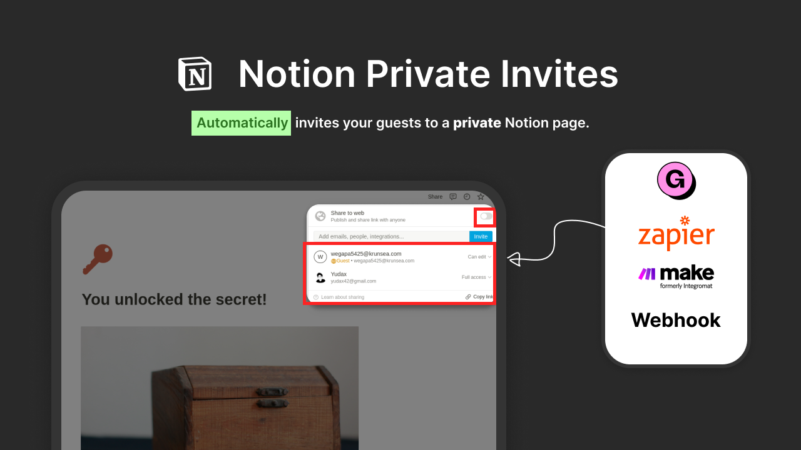
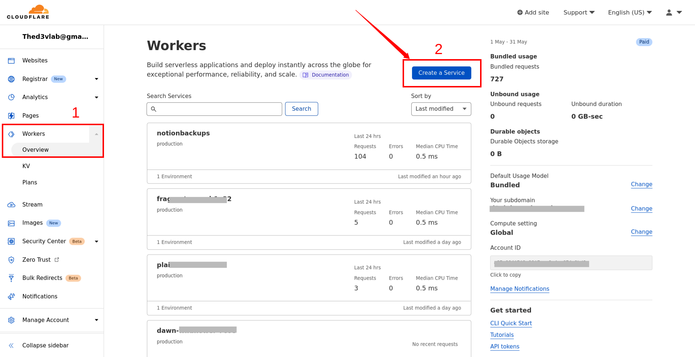
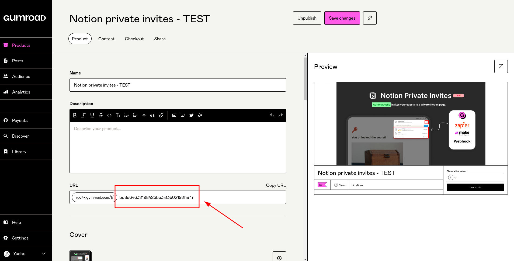
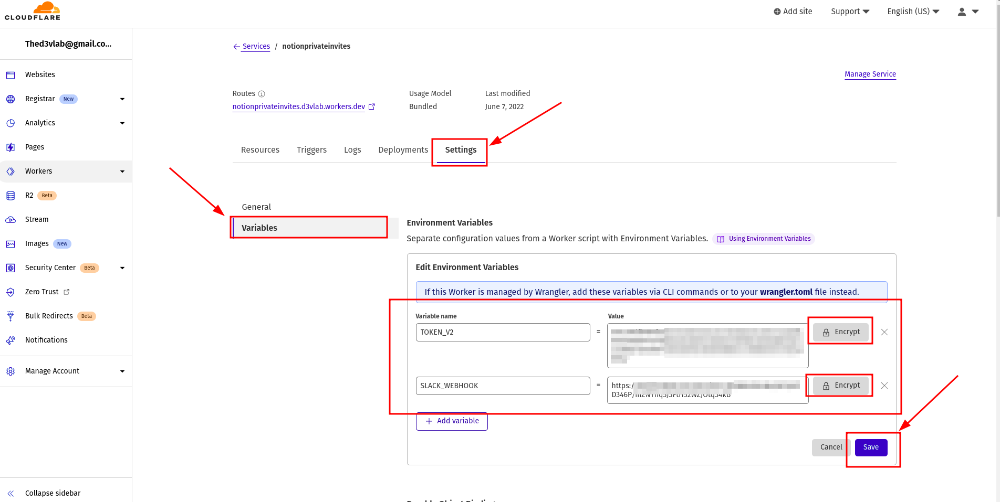
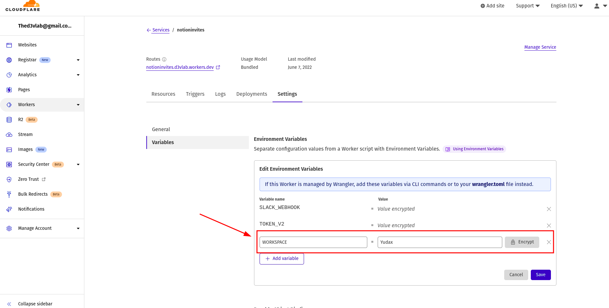
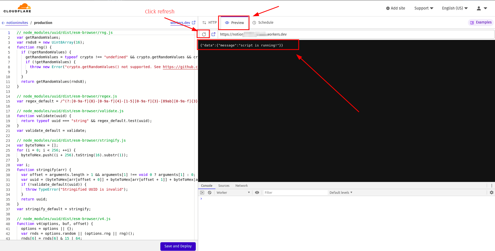
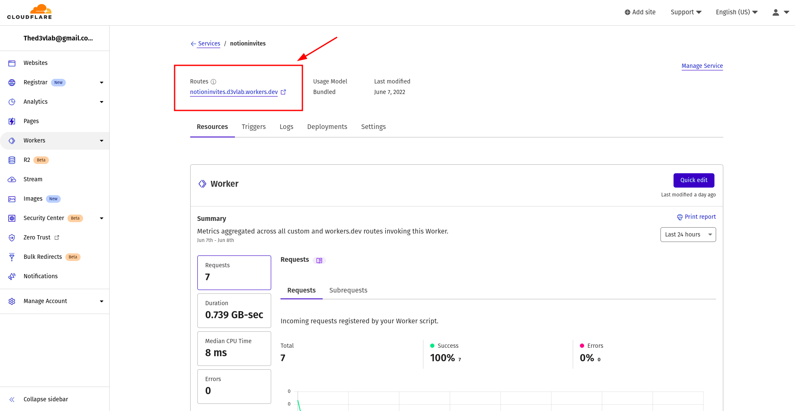
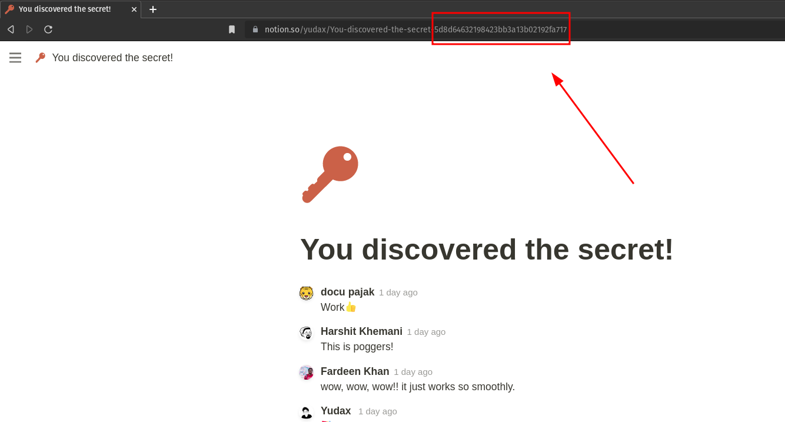
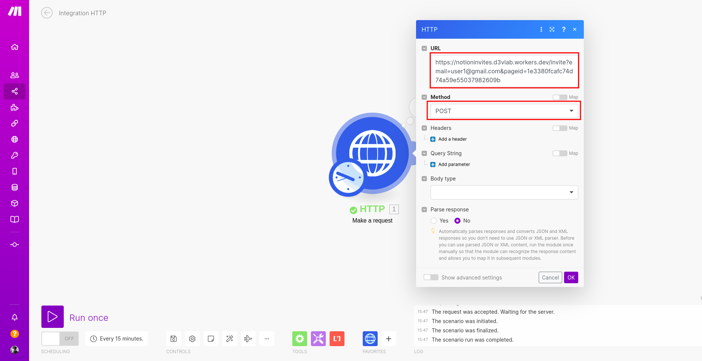
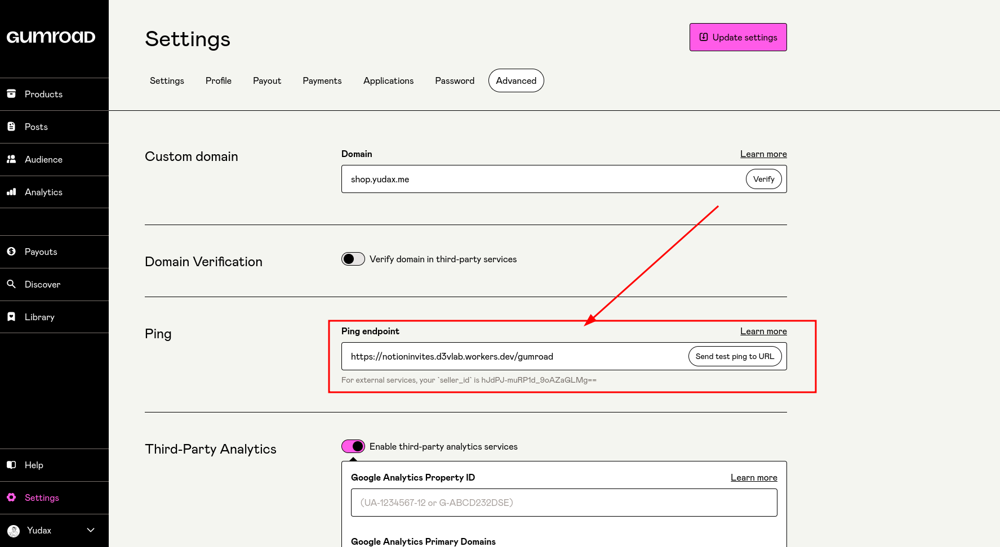

## This script will make it easier to automatically invite specifc guests to a private Notion page without making it public.

<br>

# Getting started:

## Setting up the script

1. Log in to your Cloudflare workers dashboard, go to the workers tab, and then add a new service.

   

2. Give your script a name and then click the 'create service' button.
   
3. Remove all previous code and paste the following [script code](https://github.com/notionblog/notionInvites/blob/master/src/index.js) into the editor.

   

   Click `Quick edit` button

   

   Paste the **script** code in the editor and click the `Save and Deploy` button

4. You must now configure the following environment variables:

   Navigate to your **Worker > Settings > Variables** and add the following secrets:

   - `TOKEN_V2` paste the value of your Notion token (**required)**
   - `SLACK_WEBHOOK` paste your [Slack webhook](https://api.slack.com/messaging/webhooks#posting_with_webhooks) URL (optional to receive notification via Slack)

   <aside>
   ⚠️ Encrypt the data you enter for security reasons. by pressing the Encrypt button

   </aside>

   

5. Add the name of your Notion workspace to your environment variables.

   

6. If you return to the editor and click the `preview` tab, then click `refresh` you should get this message.

   ```jsx
   {"data":{"message":"script is running!"}}
   ```

   

That's it, now that you've correctly configured the script, next i’ll show you how to use it.

## How to use the script?

### Using automation tools such as (Make, Zapier…)

After deploying the script, you will be given a public link to your API.



for example mine is https://notioninvites.d3vlab.workers.dev

To invite a new user, make a **POST** request with the parameters listed below.

**Required**:

`email` the user email that you want to invite

`pageid` your notion page id

- how to find your notion page id ⤵️
  

**Optional** (default is comment)

`permission` the permission you want to grant to the invitee

**edit →** can edit but not share with others

**comment** → can view and comment but not edit

**view** → cannot edit or share with others

**Example**:

If I want to invite a guest to this page, the request url will be

[https://notioninvites.d3vlab.workers.dev/invite?email=someone@gmail.com&pageid=1e3380fcafc74d74a59e55037982609b](https://notioninvites.d3vlab.workers.dev?email=someone@gmail.com&pageid=1e3380fcafc74d74a59e55037982609b&)

<aside>
ℹ️ make sure you add `/invite` path after the base url

</aside>

In make, for example, you can use the HTTP module and a variable to dynamically specify the user email address.

After you run the workflow, the user will be instantly invited.



## With Gumroad

Gumroad setup is much simpler, simply go to your Gumroad dashboard > settings > advanced and enter your API url followed by `/gumroad` path in the Ping section.

for example mind is:

[https://notioninvites.d3vlab.workers.dev/](https://notioninvites.d3vlab.workers.dev?email=someone@gmail.com&pageid=1e3380fcafc74d74a59e55037982609b&)gumroad

<aside>
ℹ️ Please keep this link private because anyone who obtains it will be able to invite users to your page.

</aside>



1. When you create a product, you must include your Notion `page id` in the link.


That's it, whenever a guest make a new purchase, Gumoard will automatically submit the user information, and the script will invite the user to the page.

Congratulations, you have successfully set up the script 🥳 If you have any questions, feel free to ask me on [Twitter](https://twitter.com/_yudax), and if you want to support me, you can [donate here](https://ko-fi.com/yudax), which would be greatly appreciated ❤️
